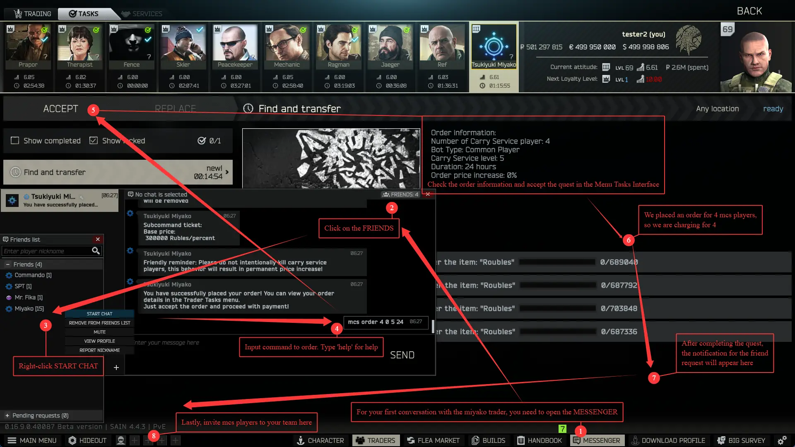
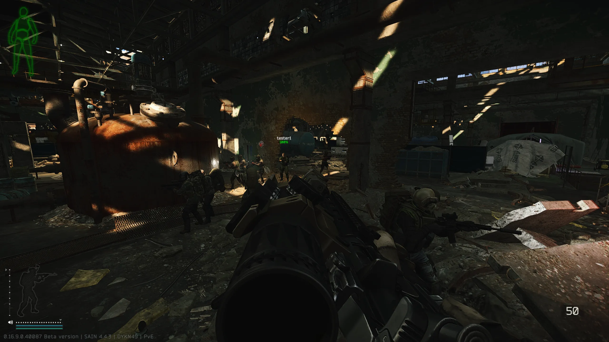
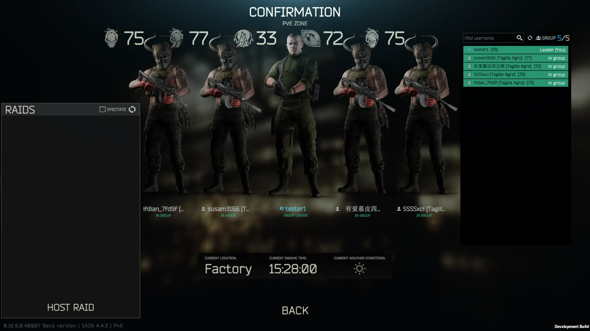
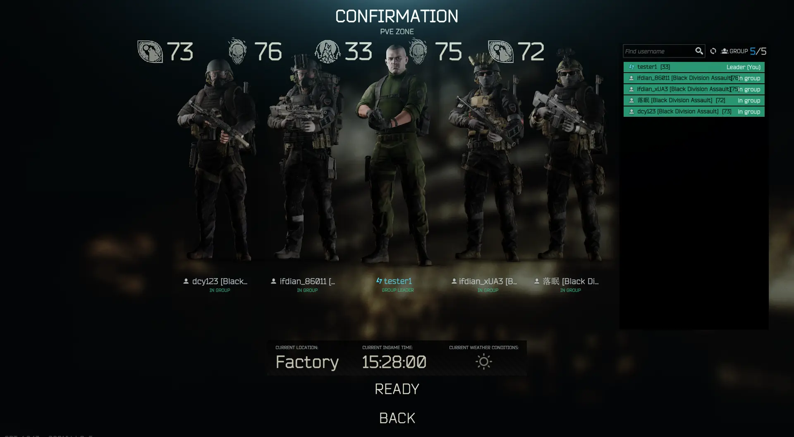
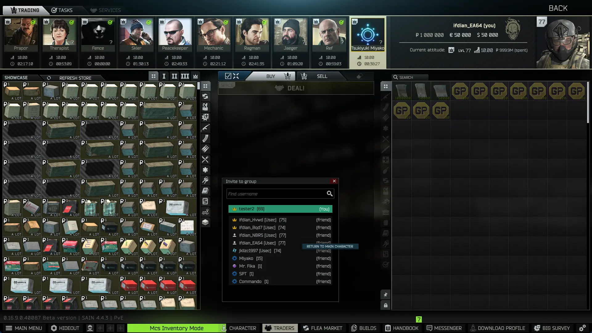

<h1>
    

        
        Miyako Carry Service 
    

</h1>

[简体中文](README.md) | [English](README-EN.md) | Русский

MiyakoCarryService - Это мод для генерации товарищей по команде, которыми управляет искусственный интеллект.

    
    

### Инструкция по использованию

---

### Демонстрация игрового процесса

---

### Титры

[SPT](https://github.com/sp-tarkov)

[SPT-PitFireTeam](https://github.com/pitAlex/SPT-PitFireTeam)

[Fika](https://github.com/project-fika)

[SAIN 3.11.X](https://github.com/Solarint/SAIN) / [SAIN 4.0.X](https://github.com/ArchangelWTF/SAIN)

[SPT-LootingBots](https://github.com/Skwizzy/SPT-LootingBots)

[SPT-BigBrain](https://github.com/DrakiaXYZ/SPT-BigBrain)
