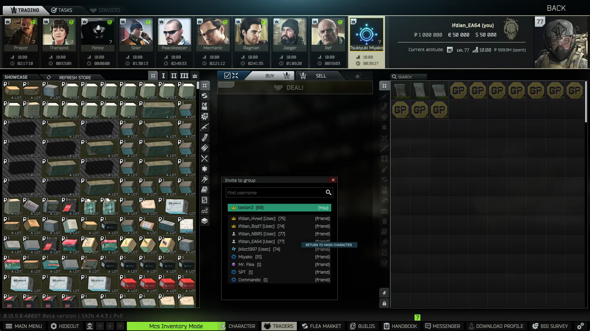

<div>
<h1>
    <p>
        
        Miyako Carry Service<br>
    </p>
</h1>

[简体中文](README.md) | [English](README-EN.md) | Русский

MiyakoCarryService - Это мод для генерации товарищей по команде, которыми управляет искусственный интеллект.

<p>
    
    
</p>
</div>

---

## Description

This document will use Mcs as the abbreviation for Miyako Carry Service; you will be referred to as `McsLeadPlayer`, and the AI teammates generated by Mcs will be referred to as `McsBotPlayer`.

Supports full customization of `McsBotPlayer` equipment through Mcs Inventory Mode, supports generating any type of AI as a `McsBotPlayer`, even AI types provided by other mods, supports `McsBotPlayers` picking up specified loot, supports commanding `McsBotPlayers` through the command system, compatible with SAIN, compatible with Fika.

---


In Fika multiplayer, each player can have their own `McsBotPlayer` squad.

---


Allows any type of AI to become your teammate, even Bosses

You can even generate AI types provided by third-party mods such as [Black Division Home](https://github.com/TacticalToaster/BlackDiv), [UNTAR Go Home!](https://github.com/TacticalToaster/TacticalToasterUNTARGH), [RUAF Come Home!](https://github.com/TacticalToaster/RUAFComeHome), as long as your configuration file is correct.


---

### What Can Mcs Offer You?

The answer: the ultimate comfortable service experience.

#### A Powerful and Flexible Command System

Beyond a handful of basic movement commands, and built upon EFT's own Action Menu, Mcs injects limitless possibilities into its command system.

This lets you assign a `McsBotPlayer` to lead you to all kinds of destinations — quest locations, exfil points, transit points, switches, and especially those areas you want to reach but whose location you don't know. In that case you can simply have them lead the way in front of you; just follow their steps and you'll arrive at your destination (provided, of course, that the location itself allows AI to go there).

You can even delegate certain actions to them to complete independently in your stead, so you don't have to handle everything personally. For example, Mcs allows proxy actions under supported quest conditions — at a single command, they can head to a quest location on their own to perform operations such as repairing, visiting quest position, or installing items. You can complete the quest without ever going to the site yourself.

Or perhaps you want to flip a switch that opens an exfil. You can order them to go operate it themselves while you head straight for the exfil; once the switch is turned on, you can simply extract, instead of having to go open the switch yourself first and then move to the exfil to extract as before.

And besides keeping you safe, if you're in a complex area with enemies potentially lurking around, you can order them to thoroughly search every corner of a specified location.

#### Make Every Gain Entirely Yours

As a mod that delivers the perfect service experience, your `McsBotPlayer` should naturally be able to actively scavenge loot according to your settings. You can set blocked item types, a loot value threshold, whether to loot items containing specific keywords, and more. They will also nest looted items to a certain degree, plundering as much of the loot you need as possible. However, in the end these gains still need to be collected by you personally before they can be carried out of the raid.

#### The Final Piece to Accomplishing Great Deeds

**The Formation System**

This system lets you configure a 7×7 formation matrix in which you can set your own position and those of your teammates, along with the spacing between them. Now you have a well-trained, powerful squad that maintains its formation at all times. You can also save the current formation as a preset via hotkey and give it a custom name, then quickly apply formation presets through the command system to handle any scenario.

#### Configurations That Take Effect Independently for Each Player

As is well known, Mcs supports installing the Fika Addon to work in a Fika multiplayer environment. And as we also know, in a Fika multiplayer environment almost all of a raid's computation is performed on the host. For that reason, we would not want every `McsBotPlayer` behavior to be dictated solely by the host. Not to worry — Mcs also supports syncing some of the configuration items, so a user acting as the host can have different squads compute using their own respective configurations, including loot scavenging configuration, formation positioning configuration, and more. I guarantee you can get the same experience as when using Mcs in your own local raid.

## Tutorial

### Installation

1. Place the folder located in the downloaded zip into your main SPT folder.
2. Mod will be activated by default.


---

### How To Generate `McsBotPlayer`

Mcs mimics a carry service in the gaming industry. In this process, you need to select the desired service, place an order and pay, and play together with the player who comes to serve you. Therefore, Mcs provides a trader `Tsukiyuki Miyako` to handle all these actions


If you cannot see the Group Panel, please check whether you have UI Fixes installed, then open Advanced Settings in the Configuration Manager, navigate to Interface -> Show Group Panel, and enable it.

---

### How to Customize `McsBotPlayer` Equipment

1. You need to have a `McsBotPlayer` that has been added as a friend.
2. Open the `Invite to group` interface from the bottom left corner of the bottom bar.
3. Right-click on the `McsBotPlayer` to bring up the right-click menu, select `OPEN INVENTORY`.
4. At this point, you will enter Mcs Inventory Mode.
5. In Mcs Inventory Mode, you can customize the `McsBotPlayer`'s equipment through operations exactly the same as normal gameplay.
6. When entering Mcs Inventory Mode, the Miyako trader will provide all items for purchase at 1 ruble
7. To return to the main character, there are two ways: one is to right-click on the `McsBotPlayer` through the `Invite to group` interface again and select `RETURN TO MAIN CHARACTER`; the other is to directly click the green Mcs Inventory Mode button on the bottom bar, which can also return to the main character.



_1. Mcs Inventory Mode modifies the `McsBotPlayer`'s equipment only in PMC mode. As is well known, PMC mode and SCAV mode are two different characters. According to game settings, you cannot control the SCAV character's equipment, so Mcs will also maintain this setting._

_2. The `McsBotPlayer`'s friend slot will become unavailable upon expiration. You may choose to settle or renew the order. Only upon successful settlement will all data of the expired `McsBotPlayer` be permanently deleted, whereas renewing will issue a new order of the same duration; once the renewal task is completed, the service expiration time will be extended._

### How to Renew and Settle  
  
1. Likewise, open the `Invite to group` interface at the bottom-left of the bottom bar.
2. Likewise, right-click on the `McsBotPlayer` to bring up the right-click menu, select `RENEW ORDER`.
3. A new quest of the same duration will then be issued; completing it finishes the renewal.
4. For an already-expired `McsBotPlayer`, selecting `SETTLE ORDER` will permanently delete all data of every `McsBotPlayer` under that order.
5. The data of an expired `McsBotPlayer` is retained indefinitely until you settle it. You can renew any `McsBotPlayer` at any time to make an expired `McsBotPlayer` available again, or to extend the expiration time of a `McsBotPlayer` that has not yet expired.

---

### How to Get Loot Picked Up by `McsBotPlayers` in Raid

When a `McsBotPlayer` picks up target loot, to get items from the `McsBotPlayer` besides looting the body after the `McsBotPlayer` dies, you can also use the `OPEN INVENTORY` command on a single `McsBotPlayer` through the Mcs command menu to remotely open the `McsBotPlayer`'s backpack while the `McsBotPlayer` is still alive, or use the `DROP TARGET LOOT` command to have them drop the items they have currently picked up during the raid right in front of you.

According to game settings, `McsBotPlayer` mimics a real player, so after they pick up loot, if you don't personally take it, everything will not belong to you after the raid ends.

> If you want it, then you'll have to take it, as you have already known.

---

### How to Customize `McsBotPlayer` Types

1. Start the server once first, and `spawntype.json` will be generated under `MiyakoCarryServiceServer/configs`.
2. If you don't understand the following content, it's recommended not to mess around with it yourself. Incorrect modifications will cause errors. If you really want to change it, read on. You can also leave it to AI to do it. If it's still changed incorrectly, just delete `spawntype.json` and restart the server, and a new file will be generated again.
3. First, you need to know the JSON format rules. It's best to use an editor like VS Code that can check JSON format.
4. Then you need to know the `WildSpawnType` names of AI provided by third-party mods or built-in to the original game.
5. Take [Black Division Home](https://github.com/TacticalToaster/BlackDiv) as an example. It provides a Black Division WildSpawnType: `blackDivAssault`.
6. Now you need to add another type in the correct format in `spawntype.json`.

```jsonc
{
    "WildSpawnType": "sectantOni",
    "IsBoss": true,
    "DisplayName": "Oni"
}, 
    // The above is the EFT native WildSpawnType. When adding new types later, 
    // you need to bring `,` after `}`.
{
    "WildSpawnType": "blackDivAssault", 
    // Write the WildSpawnType name here.
    "IsBoss": false, 
    // Whether to serve as a Boss type. 
    // When using the help command, a `[Boss]` prefix will be added for this type.
    "DisplayName": "Black Division Assault" 
    // Display name. When using the help command, 
    // only this name will be displayed, not the WildSpawnType name.
} 
    // The last `}` should not have `,`.
```

7. After ensuring the JSON format is correct and the data is filled in correctly, restart the server. At this time, use the help command in the MESSENGER interface with the Miyako trader, and all types will be displayed in the list of available types.
8. If an exception occurs when generating the customized type, you will receive an error reminder in server log and it will change to generate the default pmc type `McsBotPlayer`. At this time, you need to check whether the customized type you filled in is incorrect.

## Server Config

| Option | Description | Default |
| --- | --- | --- |
| `BalanceRestriction` | When enabled, the `OPEN INVENTORY` command for `McsBotPlayer` becomes unavailable, and all items brought into the raid receive the `Curse of Vanishing` enchantment. If the `McsBotPlayer` dies, those items vanish immediately regardless of position. | `false` |
| `CheckUpdate` | Whether to check for version updates online. | `true` |
| `CheckIfdian` | Whether to check for sponsor list updates. | `true` |
| `TicketPricePerPercent` | Per-percent ticket price used to calculate the fine paid to remove the price-increase penalty, in roubles per percent. | `300000` roubles per percent |
| `PunishmentMultiMax` | Maximum price-increase penalty multiplier. | `1` (i.e. `100%`) |
| `OrderPendingPaymentTime` | The pending duration of the action task provided by the Miyako trader when ordering a `McsBotPlayer` or issuing a ticket, in seconds. | `900` seconds (15 minutes) |
| `CompensationPrice` | Compensation paid when a `McsBotPlayer` accidentally kills the `McsLeadPlayer`, in roubles. | `300000` roubles |
| `CarryServiceLevelPrice` | Base carry-service pricing for 5 levels, with minimum and maximum bounds for each level. | Determined by level range |
| `TraderLlmEnabled` | Whether to enable the Miyako trader's AI chat (LLM). When enabled, chatting with the Miyako trader supports natural-language ordering, tickets and small talk. | `false` |
| `TraderLlmStartupTest` | Whether to run one LLM connectivity test on server startup; set to `false` after the setup is confirmed to avoid repeated cost. | `true` |
| `TraderLlmProvider` | AI provider for the Miyako trader: `OpenAICompatible` (covers OpenAI / DeepSeek / Moonshot / Ollama / vLLM etc.), `Anthropic`, `GoogleGemini`, `DashScope`, `Zhipu`, `Qianfan`, `Spark`, `MiniMax`. | `OpenAICompatible` |
| `TraderLlmApiKey` | API key for the Miyako trader's AI provider. | empty |
| `TraderLlmBaseUrl` | Optional custom base URL for the Miyako trader's AI (overrides the provider default). | empty |
| `TraderLlmModelId` | Model name for the Miyako trader's AI, provider-specific. | `deepseek-v4-flash` |
| `TraderLlmSystemPrompt` | Optional custom system prompt prepended to the default prompt. | empty |
| `TraderLlmTemperature` | Sampling temperature for the Miyako trader's AI, 0..2; lower is more deterministic. | `0.2` |
| `TraderLlmMaxTokens` | Maximum tokens per reply of the Miyako trader's AI; affects reply length and cost. | `3000` |
| `TraderLlmTimeoutSec` | Per-request timeout in seconds for the Miyako trader's AI. | `15` |
| `TraderLlmMaxMessagesPerMinute` | Maximum replies per minute from the Miyako trader's AI (rate limit). | `10` |
| `TraderLlmMaxHistoryMessages` | Number of recent chat messages carried as context for the Miyako trader's AI; set `0` to disable. | `20` |
| `TraderLlmApiSecret` | Secondary key (Secret/Token) of the Miyako trader's AI provider. Required by two-key providers such as Zhipu (ApiKey=id + ApiSecret=secret) and Spark (ApiKey:ApiSecret); leave empty when using an all-in-one ApiKey. | empty |
| `TraderLlmReasoningEffort` | Reasoning effort of the Miyako trader's AI: default / low / medium / high / max; default or empty means the parameter is not sent, and it degrades automatically when unsupported. | `low` |
| `TraderLlmMaxConcurrent` | Global concurrency limit for the Miyako trader's LLM requests. Excess requests queue up and are released as slots free up, protecting upstream APIs and proxies. | `16` |
| `HttpProxyHost` | HTTP proxy host used when routing cloud requests (LLM/STT etc.) through a proxy. | empty |
| `HttpProxyPort` | HTTP proxy port (paired with `HttpProxyHost`). | empty |

## Features

### A. Basic

| Feature | Description |
| --- | --- |
| `Enable Looting` | Whether `McsBotPlayer` will attempt to loot items while not currently in combat. |
| `Price Threshold` | Loot below this price will be ignored. |
| `Loot Name Keyword` | Keywords are substrings contained in an item's full or abbreviated name. Multiple keywords may be separated by `\|\|`，`,`，`，`. |
| `Loot Keyword Items` | Whether `McsBotPlayer` will attempt to loot keyword-matched items. |
| `Blocked Item Types` | Supports select all / deselect all: `Ammo`, `Barter`, `Info`, `Container`, `Food`, `Backpack`, `Goggles`, `Pocket`, `Tactical Vest`, `Armor`, `Grenade`, `Headphone`, `Keys`, `Knife`, `Magazine`, `Meds`, `Mod`, `Special`, `Weapon`, `Other`. |
| `Enable Keep Formation` | Whether to determine `McsBotPlayer` positions based on the formation matrix configuration. |
| `Formation Matrix` | Used to configure the position of each `McsBotPlayer`. `★` represents your position, and the area above `★` indicates your facing direction. |
| `Formation Spacing` | The spacing between formation members. |
| `Formation Sequential Fill` | When enabled, if a `McsBotPlayer` dies in formation, the next squad member fills the empty slot in brevity-code order. |
| `Save Formation Preset Hotkey` | Saves the current formation preset and binds a hotkey. |

> When Fika is installed, in-raid setting changes are synced to the host automatically, but this requires the **MiyakoCarryServiceFika** addon to be installed first.

### B. Command

#### MemberCommand

| Command | Description |
| --- | --- |
| `Report Enemy Position` | If `McsBotPlayer` is currently in combat, command it to report known enemy positions. |
| `Report Self Status` | Command `McsBotPlayer` to report its own health and supply status. |
| `On Your Own` | Command `McsBotPlayer` to act independently. |
| `Regroup` | Command `McsBotPlayer` to stop all actions and regroup. |
| `Follow Me` | Command `McsBotPlayer` to follow the `McsLeadPlayer`. In this state, it will not proactively attack enemies or loot. |
| `Exclude / Takeover` | `Exclude` prevents `McsBotPlayer` from receiving team commands, while `Take Over` restores team-command control. |
| `Go To` | If `McsBotPlayer` is not currently in combat, command it to go to a specified location. |
| `Hold Position` | If `McsBotPlayer` is not currently in combat, command it to stay in place. |
| `Force Teleport` | Clears `McsBotPlayer` aggro and attempts to teleport it to the current location. |
| `Open Inventory` | Remotely opens the `McsBotPlayer` inventory to transfer picked-up loot. |
| `Change Aiming Body Part Type` | Commands `McsBotPlayer` to change its preferred combat aiming body part. |
| `Escort` | If `McsBotPlayer` is not currently in combat, command it to escort to the designated location. Sub-items include `Quest Escort`, `Exfil Escort`, `Transit Escort`, `Switch Escort`, `Stationary Weapon Escort`, `BTR Escort`, and `Airdrop Escort`. |
| `Proxy Action` | If `McsBotPlayer` is not currently in combat, command it to proxy-execute the related action. Sub-items include `Quest Proxy Action`, `Door Proxy Action`, `Loot Proxy Action`, and `Switch Proxy Action`. |
| `Drop Target Loot` | If `McsBotPlayer` is not currently in combat, command it to drop the target loot picked up during the raid. |
| `Clear Area` | If `McsBotPlayer` is not currently in combat, command it to clear the surrounding area of a specified location. |

#### TeamCommand

| Command | Description |
| --- | --- |
| `Team Report Enemy Position` | If there are `McsBotPlayers` in the team currently in combat, command them to report known enemy positions. |
| `Team Report Self Status` | Command `McsBotPlayers` to report their own health and supply status. |
| `Team On Your Own` | Command `McsBotPlayers` to act independently. |
| `Team Regroup` | Command all `McsBotPlayers` to stop all actions and regroup. |
| `Team Follow Me` | Command all `McsBotPlayers` to follow the `McsLeadPlayer`. In this state, they will not proactively attack enemies or loot. |
| `Team Go To` | If there are `McsBotPlayers` in the team not currently in combat, command them to go to a specified location. |
| `Team Hold Position` | If there are `McsBotPlayers` in the team not currently in combat, command them to stay in place. |
| `Team Force Teleport` | Clears aggro for all team `McsBotPlayers` and attempts to teleport them to the current location. |
| `Team Change Aiming Body Part Type` | Command `McsBotPlayers` to change their preferred combat aiming body part. |
| `Team Escort` | If there are `McsBotPlayers` in the team not currently in combat, command them to escort to the designated location. Sub-items include `Team Quest Escort`, `Team Exfil Escort`, `Team Transit Escort`, `Team Switch Escort`, `Team Stationary Weapon Escort`, `Team BTR Escort`, and `Team Airdrop Escort`. |
| `Team Drop Target Loot` | If there are `McsBotPlayers` in the team not currently in combat, command them to drop the target loot picked up during the raid. |
| `Team Clear Area` | If there are `McsBotPlayers` in the team not currently in combat, command them to clear the surrounding area of a specified location. |
| `Change Formation` | Apply the saved formation preset immediately. |

> The command system also works normally during Fika multiplayer, but this requires the **MiyakoCarryServiceFika** addon to be installed first.

### C. Player

| Setting | Description |
| --- | --- |
| `Teammate Highlight` | Whether to highlight all `McsBotPlayer` characters in raid. |
| `Teammate Highlight Hotkey` | Hotkey configuration for teammate highlighting. |
| `Teammate Highlight Color` | Highlight color configuration. |
| `Enable Mcs Subtitles` | Whether to use subtitles to display `McsBotPlayer` reports. |
| `Show Brevity Code` | Use brevity codes to replace the original nicknames for display. |

## Assistant Addon

### D. Assistant

| Option | Description | Default |
| --- | --- | --- |
| `VoiceEnabled` | Enable Assistant voice command recognition (STT + LLM). Required to use voice control over AI escorts. | `false` |
| `VoiceTriggerMode` | Trigger mode: PushToTalk holds a key to talk; FreeTalk auto-records via VAD without key. | `PushToTalk` |
| `VoiceHotKey` | Hotkey for PushToTalk mode. Ignored under FreeTalk. | `Empty` |
| `VoiceCaptureMaxSeconds` | Maximum single recording length in seconds. Long phrases are cut at this limit. | `15f` |
| `VoiceVadEnergyThreshold` | RMS energy threshold that triggers speech start in FreeTalk. Lower if whispers are ignored. | `0.01f` |
| `VoiceVadSilenceSeconds` | Silence duration to end the recording in FreeTalk. | `1f` |
| `VoiceFeedbackSubtitles` | Show in-game notification after each voice command is dispatched. | `true` |
| `RecordDevice` | Select the recording device used for voice recognition; Default means the system default device. If the list is empty, check your microphone devices in system settings. | `"Default"` |
| `SttProvider` | Cloud Speech-to-Text provider | `OpenAIWhisper` |
| `SttApiKey` | API key for the chosen STT provider. | `Empty` |
| `SttApiSecret` | Second key (secret/token) for two-key providers (Xfyun/Tencent/Baidu/Volc/Aliyun); leave empty for single-key providers. | `Empty` |
| `SttBaseUrl` | Optional custom STT base URL (overrides per-provider default). | `Empty` |
| `SttModelId` | Optional STT model name (provider-specific). Leave blank for default. | `Empty` |
| `SttLanguage` | Hint language code in BCP-47 (e.g. zh-CN, en-US, ja-JP) for STT. | `Empty` |
| `SttTimeoutSec` | Per-request STT timeout in seconds. | `15` |
| `LlmProvider` | Cloud LLM provider; OpenAI-Compatible covers OpenAI / DeepSeek / Moonshot / Ollama / vLLM etc. | `OpenAICompatible` |
| `LlmApiKey` | API key for the chosen LLM provider. | `Empty` |
| `LlmApiSecret` | Second key (secret/token) for two-key providers; leave empty for single-key providers. | `Empty` |
| `LlmBaseUrl` | Optional custom LLM base URL (overrides per-provider default for OpenAI-Compatible). | `Empty` |
| `LlmModelId` | LLM model name. Provider-specific; default deepseek-v4-flash for OpenAI-Compatible. | `"deepseek-v4-flash"` |
| `LlmSystemPrompt` | Optional custom system prompt prepended to Assistant's voice-command instruction template. | `Empty` |
| `LlmTemperature` | LLM sampling temperature, 0..2. Lower is more deterministic. | `0.2` |
| `LlmMaxTokens` | Maximum tokens LLM may emit. Affects cost/latency. | `10107` |
| `LlmTimeoutSec` | Per-request LLM timeout in seconds. | `15` |
| `LlmReasoningEffort` | LLM reasoning effort: default / low / medium / high / max. Options are provided only; whether this model supports it depends on the actual endpoint. default omits the parameter; unsupported models usually ignore it. | `"low"` |
| `HttpProxyHost` | HTTP proxy hostname or IP used by LLM/STT requests (e.g. 127.0.0.1); empty means direct connection. When configured, all requests (including local addresses) go through the proxy. | `Empty` |
| `HttpProxyPort` | HTTP proxy port (e.g. 7890); must be configured together with the proxy host, empty means direct connection. | `Empty` |

### Z. Debug

| Option | Description | Default |
| --- | --- | --- |
| `SttDebugEnabled` | When enabled, records and transcribes using the current configuration; the transcribed text overwrites the STT debug text field. | `false` |
| `SttDebugText` | The latest transcription result of a recording. | `Empty` |
| `VoiceDebugVadText` | Live speech detection status for FreeTalk (RMS energy / speech flag / silence timer). Read-only. | `Empty` |
| `LlmDebugSend` | Sends the STT debug text to the LLM for testing; the reply or error overwrites the LLM result field. | `false` |
| `LlmDebugResult` | The latest reply or error message of an LLM test. | `Empty` |
| `LlmDebugAutoEnabled` | When enabled, after STT transcription in debug mode, automatically calls the LLM for command recognition testing; the result is shown in 'Command Recognition Result'. | `false` |
| `LlmDebugAutoResult` | The latest automatic command recognition result, showing what command the LLM would actually call. | `Empty` |
| `VoiceDebugPlay` | Play back the most recent voice recording (debug playback; requires a successful recording first) | `false` |

## Language

- English (AI Translate)
- 简体中文
- русский язык (Contributed by NotDifficult)

## WildSpawnType

<details>

<summary>EFT Native</summary>

- marksman
- assault
- bossTest
- bossBully (Mcs default support)
- followerTest
- followerBully
- bossKilla (Mcs default support)
- bossKojaniy (Mcs default support)
- followerKojaniy
- pmcBot (Mcs default support)
- cursedAssault
- bossGluhar (Mcs default support)
- followerGluharAssault
- followerGluharSecurity
- followerGluharScout
- followerGluharSnipe
- followerSanitar
- bossSanitar (Mcs default support)
- test
- assaultGroup
- sectantWarrior
- sectantPriest
- bossTagilla (Mcs default support)
- followerTagilla
- exUsec (Mcs default support)
- gifter
- bossKnight (Mcs default support)
- followerBigPipe (Mcs default support)
- followerBirdEye (Mcs default support)
- bossZryachiy (Mcs default support)
- followerZryachiy
- bossBoar (Mcs default support)
- followerBoar
- arenaFighter
- arenaFighterEvent
- bossBoarSniper
- crazyAssaultEvent
- peacefullZryachiyEvent
- sectactPriestEvent
- ravangeZryachiyEvent
- followerBoarClose1
- followerBoarClose2
- bossKolontay (Mcs default support)
- followerKolontayAssault
- followerKolontaySecurity
- shooterBTR
- bossPartisan (Mcs default support)
- spiritWinter
- spiritSpring
- peacemaker
- pmcBEAR (Mcs default support)
- pmcUSEC (Mcs default support)
- skier
- sectantPredvestnik (Mcs default support)
- sectantPrizrak (Mcs default support)
- sectantOni (Mcs default support)
- infectedAssault (Mcs default support)
- infectedPmc (Mcs default support)
- infectedCivil
- infectedLaborant
- infectedTagilla (Mcs default support)
- bossTagillaAgro (Mcs default support)
- bossKillaAgro (Mcs default support)
- tagillaHelperAgro

</details>

### [Black Division Home](https://github.com/TacticalToaster/BlackDiv)

- blackDivLead
- blackDivAssault
- blackDivBreacher
- blackDivSupport

### [UNTAR Go Home!](https://github.com/TacticalToaster/TacticalToasterUNTARGH)

- followeruntar
- bossuntarlead
- followeruntarmarksman
- bossuntaroffice

### [RUAF Come Home!](https://github.com/TacticalToaster/RUAFComeHome)

- ruafRifleman
- ruafRiflemanSenior
- ruafAutorifleman
- ruafGrenadier
- ruafMarksman
- ruafMachinegunner

---

### Титры

[SPT](https://github.com/sp-tarkov)

[SPT-PitFireTeam](https://github.com/pitAlex/SPT-PitFireTeam)

[Fika](https://github.com/project-fika)

[SAIN 3.11.X](https://github.com/Solarint/SAIN) / [SAIN 4.0.X](https://github.com/ArchangelWTF/SAIN)

[SPT-LootingBots](https://github.com/Skwizzy/SPT-LootingBots)

[SPT-BigBrain](https://github.com/DrakiaXYZ/SPT-BigBrain)

### Поддержите меня

[Ko-Fi](https://ko-fi.com/himesamanoyume) | [Ifdian](https://ifdian.net/a/himesamanoyume)
