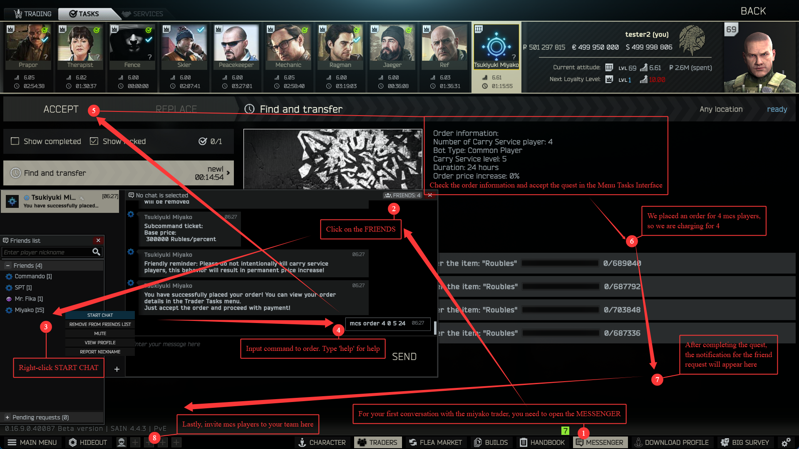
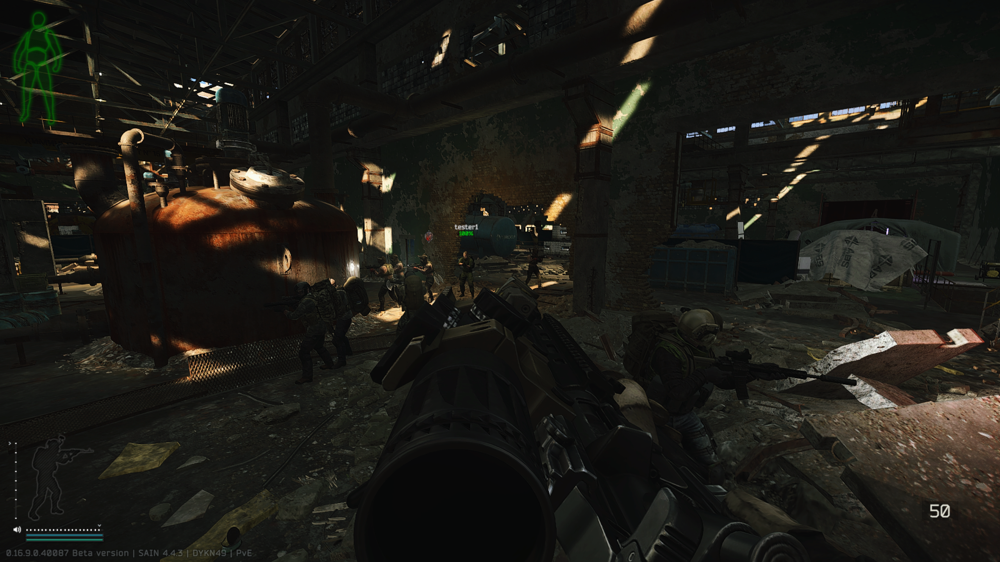
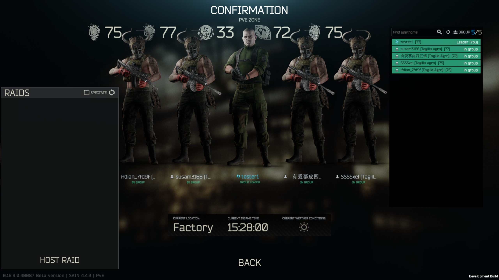
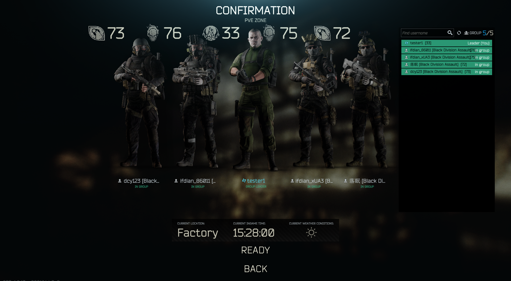
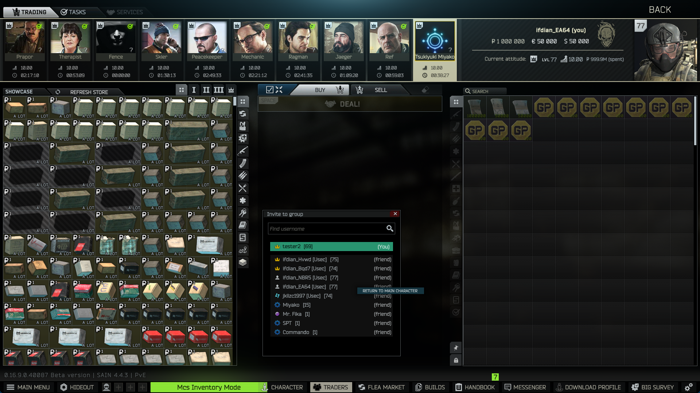

<h1>
    
    Miyako Carry Service 
</h1>

简体中文 | [English](README-EN.md)

宫子护航店 (MiyakoCarryService) 是一个生成AI队友的模组

    
    

### 预览

### 鸣谢

[SPT](https://github.com/sp-tarkov)

[SPT-PitFireTeam](https://github.com/pitAlex/SPT-PitFireTeam)

[Fika](https://github.com/project-fika)

[SAIN 3.11.X](https://github.com/Solarint/SAIN) / [SAIN 4.0.X](https://github.com/ArchangelWTF/SAIN)

[SPT-LootingBots](https://github.com/Skwizzy/SPT-LootingBots)

[SPT-BigBrain](https://github.com/DrakiaXYZ/SPT-BigBrain)