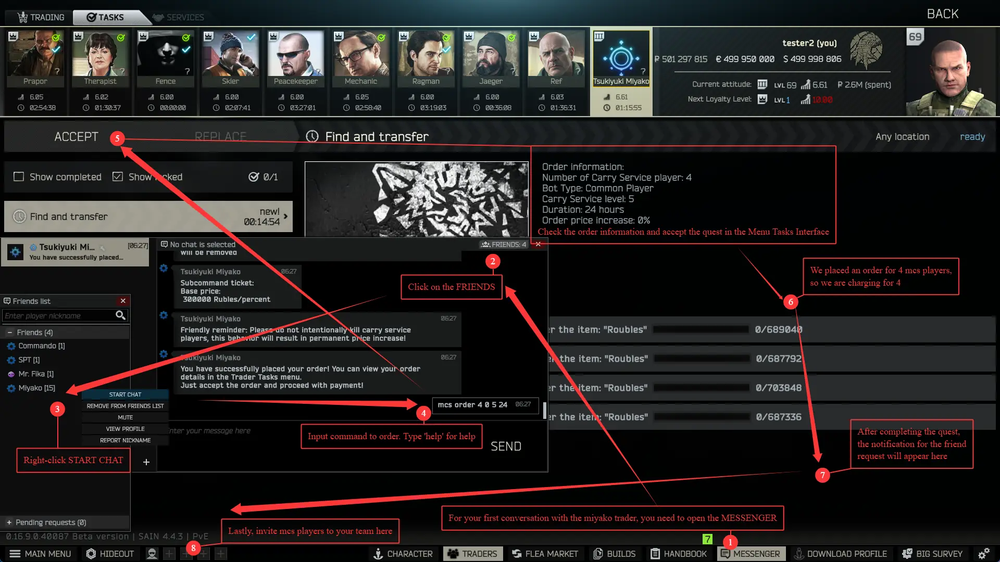

<div>
<h1>
    
    宫子护航店<br>
</h1>

简体中文 | [English](README-EN.md) | [Русский](README-RU.md)

宫子护航店 (MiyakoCarryService) 是一个生成AI队友的模组

<p>
    
    
</p>
</div>

## 描述

本文档会把 `Miyako Carry Service` 简称为 `Mcs`；你将会被称为 `老板`(McsLeadPlayer)，由 Mcs 生成的 AI 队友会被称为 `护航`(McsBotPlayer)。

支持通过 `护航库存模式` 对 `护航` 的装备进行完整自定义，支持把任意类型的 AI 生成作为 `护航`，甚至可以是其他模组提供的 AI 类型；支持 `护航` 按指定规则拾取物资；支持通过指令系统对 `护航` 下达命令；兼容 `SAIN`，兼容 `Fika`。

---


在 `Fika` 多人模式中，每个玩家都可以拥有自己的 `护航` 小队。

---


让任意类型的 AI 都能成为你的队友，甚至是 Boss。

只要你的配置文件正确，你甚至可以生成由第三方模组提供的 AI 类型，例如 [Black Division Home](https://github.com/TacticalToaster/BlackDiv)、[UNTAR Go Home!](https://github.com/TacticalToaster/TacticalToasterUNTARGH)、[RUAF Come Home!](https://github.com/TacticalToaster/RUAFComeHome)。


---

### Mcs 能为你带来什么？

答案是：极致舒适的服务体验。

#### 强大且灵活的指令系统

除了一些较为基础的行动指令以外，依托于 `EFT` 中自带的操作菜单，为指令系统注入了无限的可能性。

这允许您指派AI队友引领您前往各种目标区域，比如各种任务地点、各个撤离点、各个转移点、各个开关，特别是那些你自己想要前往但是您不清楚位置在哪的区域，这时您就可以选择让他们为您在前方带路，您只需跟随他们的脚步，就可以到达目的地（当然前提是这些地点本身允许AI前往）

您甚至可以让他们直接代替您去独立执行某些行为，这样您就不需要事事都亲力亲为了，比如Mcs允许在已支持的任务条件下进行代理行动，只需要一声令下，他们就可以独自前往任务地点，进行修理、探点、安装等操作，您不需要到现场，也能完成任务

又或者您希望打开某个开启撤离点的开关，那么您可以下令让他们自己前去操作，自己则径直前往撤离点，等到开关被开启后，您就可以直接撤离了，而不必像以往一样自己前去打开开关，再前往撤离点撤离

他们除了保您无虞以外，如果您处于一个复杂的区域，周围可能潜藏有敌人，那么您也可以下令让他们彻底搜查指定地点的每一个角落

#### 让一切收益都归你所有

作为提供完美服务体验的模组，您的AI队友自然应该能够依据您的设置，主动搜刮对应的战利品。您可以设定屏蔽的物品类型，战利品价值阈值，是否搜刮具有特定关键词的战利品等等，并且他们会在一定程度上对搜刮来的战利品进行嵌套，尽可能更多地掠夺一切您需要的战利品，不过最终这些收获都还是需要您亲自领取后才能带出战局

#### 登神长阶的最后一块拼图

**队形系统**

该系统允许您配置一个`7x7`大小的队形矩阵，您可以在其中设定自己与其他队友的站位、间距，现在您已拥有了一支训练有素、时刻保持阵型的强大小队。您还可以通过快捷键将当前的队形保存为预设，并自定义队形名称，然后您将通过指令系统快速应用队形预设，以应对任何场景

#### 可按玩家独立生效的配置

总所周知，Mcs支持安装Fika Addon以做到在Fika联机环境下使用，而我们也知道，在Fika联机环境下，战局中几乎一切的运算都是在主机上进行的，也因此我们不会希望所有的AI队友行为全部以主机为准，没关系，Mcs也支持将部分配置项进行同步，实现作为主机的玩家能够为不同的玩家小队使用他们各自的配置来进行运算，包括战利品的掠夺配置、队形站位的配置等等，我保证您可以获得与您在自己本地战局中使用Mcs时同样的体验

## 教程

### 安装

1. 将下载到的压缩包中的文件夹放入你的主 `SPT` 文件夹中。
2. 模组默认会被激活。


---

### 如何生成 `护航`

Mcs 模仿现实中的护航服务流程。在这个过程中，你需要选择所需的服务，下单并支付，然后与来为你提供服务的玩家一起游玩。因此，Mcs 提供了一个名为 `月雪宫子`(我老婆) 的商人来处理这些事务。



如果你看不到分组面板，请先检查是否安装了 `UI Fixes`，然后在配置管理器中打开 `Advanced Settings`，进入 `Interface -> Show Group Panel`，并启用它。

---

### 如何自定义 `护航` 装备

1. 你需要先把某个已加入好友列表的 `护航` 作为好友。
2. 从底部栏左下角打开 `邀请至队伍` 界面。
3. 右键点击 `护航` 打开右键菜单，选择 `打开库存`。
4. 此时你将进入 `护航库存模式`。
5. 在 `护航库存模式` 中，你可以像正常游戏一样通过操作来自定义 `护航` 的装备。
6. 进入 `护航库存模式` 后，宫子 商人会提供所有物品供你以 `1` 卢布购买。
7. 想回到主角色，有两种方式：一种是再次通过 `邀请至队伍` 界面右键点击 `护航`，选择 `返回主角色`；另一种是直接点击底部栏上的绿色 `护航库存模式` 按钮，也能返回主角色。


_1. `护航库存模式` 仅在 `PMC` 模式下修改 `护航` 的装备。众所周知，`PMC` 模式和 `SCAV` 模式是两种不同角色。根据游戏设定，你无法控制 `SCAV` 角色的装备，因此 Mcs 也会保持这一设定。_

_2. `护航` 的好友槽位在服务到期后会变得不可用。你可以选择结算或续订订单。只有在成功结算后，已过期 `护航` 的全部数据才会被永久删除；而续订会发放同等时长的新订单；一旦续订任务完成，服务到期时间也会相应延长。_

### 如何续订与结算

1. 同样地，打开底部栏左下角的 `邀请至队伍` 界面。
2. 同样地，右键点击 `护航` 打开右键菜单，选择 `续订`。
3. 然后会发放一项同等时长的新任务，完成后即可完成续订。
4. 对于已过期的 `护航`，选择 `结算` 会永久删除该订单下所有 `护航` 的全部数据。
5. 过期 `护航` 的数据会被保留到你主动结算为止。你可以随时续订任何 `护航`，让过期的 `护航` 再次可用，或者延长尚未过期 `护航` 的服务时间。

---

### 如何在战局中获取 `护航` 拾取的物资

当 `护航` 拾取目标物资时，如果你不想等到它死亡后再通过尸体捡回这些物品，那么除了 `护航` 死亡后清理尸体外，你还可以在 `Mcs` 指令菜单中对单个 `护航` 使用 `打开背包` 指令，在它还活着的时候远程打开它的背包；或者使用 `丢出目标战利品` 指令，让它在战局中把当前已经拾取的目标物资直接丢到你面前。

根据游戏设定，`护航` 会模仿真实玩家的行为，因此在它拾取物资后，如果你自己不亲自拿走，那么这些物资在战局结束后都不会属于你。

> If you want it, then you'll have to take it, as you have already known.

---

### 如何自定义 `护航` 类型

1. 先启动一次服务器，此时会在 `MiyakoCarryServiceServer/configs` 目录下生成 `spawntype.json`。
2. 如果你不理解下面的内容，建议不要随意改动。错误的修改会导致报错。如果你真的想改，继续往下看。你也可以交给 AI 来处理。如果改得还是不对，就删除 `spawntype.json` 并重新启动服务器，新的文件会重新生成。
3. 首先，你需要了解 JSON 格式规则。最好使用像 VS Code 这样的编辑器来检查 JSON 格式。
4. 然后，你需要了解由第三方模组提供或原版游戏内置的 `WildSpawnType` 名称。
5. 以 [Black Division Home](https://github.com/TacticalToaster/BlackDiv) 为例。它提供了一个黑暗分部的 `WildSpawnType`：`blackDivAssault`。
6. 现在你需要按照正确格式，在 `spawntype.json` 中添加另一种类型。

```jsonc
{
    "WildSpawnType": "sectantOni",
    "IsBoss": true,
    "DisplayName": "Oni"
}, 
    // 上面的内容是 EFT 原生的 `WildSpawnType`。之后再添加新类型时，
    // 需要在 `}` 后补上 `,`。
{
    "WildSpawnType": "blackDivAssault", 
    // 在这里写 `WildSpawnType` 名称。
    "IsBoss": false, 
    // 是否作为 Boss 类型。
    // 在使用帮助命令时，会为此类型添加 `[Boss]` 前缀。
    "DisplayName": "Black Division Assault" 
    // 显示名称。在使用帮助命令时，
    // 只会显示这个名称，不显示 `WildSpawnType` 名称。
} 
    // 最后一个 `}` 不要加 `,`。
```

7. 确认 JSON 格式正确且数据填写无误后，重新启动服务器。这时，在 宫子 商人的 `MESSENGER` 界面中使用帮助命令，就能在可用类型列表中看到全部类型。
8. 如果在生成自定义类型时发生异常，你会在服务器日志中收到错误提示，并会回退到默认生成与你同阵营的PMC类型。此时，你需要检查你填写的自定义类型是否有误。

## 服务端配置

| 配置项 | 说明 | 默认值 |
| --- | --- | --- |
| BalanceRestriction | 启用后，`护航` 的 `打开背包` 指令将不可用，且所有带入战局的物品会获得 `消失诅咒` 附魔；当 `护航` 死亡后，无论此带入物品当前身处何处，都会立即消失。 | `false` |
| CheckUpdate | 是否在线检查版本更新。 | `true` |
| CheckIfdian | 是否检查赞助者列表更新。 | `true` |
| TicketPricePerPercent | 用于计算申请罚单移除涨价惩罚时所支付罚金的单价，单位为卢布/百分比。 | `300000` 卢布/百分比 |
| PunishmentMultiMax | 最大涨价惩罚倍数。 | `1`（即 `100%`） |
| OrderPendingPaymentTime | 通过 宫子 商人下单 `护航` 或发放补票时，行动任务的有效等待时间，单位为秒。 | `900` 秒（15 分钟） |
| CompensationPrice | 当 `护航` 意外击杀 `老板` 时的补偿金额，单位为卢布。 | `300000` 卢布 |
| CarryServiceLevelPrice | 护航等级基础定价，共 5 个等级，每个等级都设有上下限。 | 由等级区间决定 |
| TraderLlmEnabled | 是否启用宫子商人的 AI 对话功能（大语言模型）。启用后，与宫子商人聊天时将支持自然语言下单、下发罚单。 | `false` |
| TraderLlmStartupTest | 是否在服务端启动时自动执行一次 LLM 连通性测试；配置完成后可设为 `false` 避免每次启动消耗。 | `true` |
| TraderLlmProvider | 宫子商人 AI 使用的服务商：`OpenAICompatible`（兼容 OpenAI / DeepSeek / Moonshot / Ollama / vLLM 等）、`Anthropic`、`GoogleGemini`、`DashScope`、`Zhipu`、`Qianfan`、`Spark`、`MiniMax`。 | `OpenAICompatible` |
| TraderLlmApiKey | 宫子商人 AI 服务商的 API Key。 | 空 |
| TraderLlmBaseUrl | 可选自定义宫子商人 AI 的 Base URL（覆盖服务商默认值）。 | 空 |
| TraderLlmModelId | 宫子商人 AI 的模型名，服务商相关。 | `deepseek-v4-flash` |
| TraderLlmSystemPrompt | 可选自定义系统提示词，将拼接在默认提示词之前。 | 空 |
| TraderLlmTemperature | 宫子商人 AI 的采样温度，范围 0到2，值越低结果越确定。 | `0.2` |
| TraderLlmMaxTokens | 宫子商人 AI 单次回复的最大 Tokens，影响回复长度与成本。 | `3000` |
| TraderLlmTimeoutSec | 宫子商人 AI 单次请求的超时秒数。 | `15` |
| TraderLlmMaxMessagesPerMinute | 宫子商人 AI 每分钟最大回复条数（限流）。 | `10` |
| TraderLlmMaxHistoryMessages | 宫子商人 AI 对话中携带的最近聊天记录条数，用于保持对话连贯；设为 `0` 关闭。 | `20` |
| TraderLlmApiSecret | 商人 AI 服务商的第二密钥（Secret/Token）。智谱（ApiKey=id + ApiSecret=secret）、星火（拼接 ApiKey:ApiSecret）等双密钥服务商需要时填写；使用一体式 ApiKey 可留空。 | 空 |
| TraderLlmReasoningEffort | 商人 AI 的思考强度：default / low / medium / high / max；default 或空表示不传参，模型不支持时自动降级。 | `low` |
| TraderLlmMaxConcurrent | 商人 LLM 全局并发请求上限。达到上限后请求排队，任一完成自动放行队首，保护上游 API 与代理。 | `16` |
| HTTP 代理地址 | HTTP 代理主机（LLM/STT 等云端请求经代理转发时填写）。 | 空 |
| HTTP 代理端口 | HTTP 代理端口（与 `HttpProxyHost` 配合使用）。 | 空 |

## 功能

### A. 基础

| 功能项 | 说明 |
| --- | --- |
| 开启掠夺 | 如果 `护航` 当前未处于战斗中，是否尝试拾取物品。 |
| 价值阈值 | 低于该价格的物品将被忽略。 |
| 战利品名称关键词 | 关键词为物品完整名称或缩写中包含的文本，支持使用 `\|\|`，`,`，`，` 分隔多个关键词进行搜索。 |
| 掠夺关键词战利品 | `护航` 是否尝试拾取带有关键词的物品。 |
| 屏蔽物品类型 | 支持全选/全不选：`子弹`、`交换品`、`情报类`、`容器`、`食物`、`背包`、`护目镜`、`口袋`、`胸挂`、`背心`、`耳机`、`手雷`、`钥匙`、`近战武器`、`弹匣`、`医疗品`、`配件`、`特殊道具`、`枪械`、`其他`。 |
| 开启保持队形 | 是否基于队形矩阵配置来决定 `护航` 的位置。 |
| 队形矩阵 | 用于配置每个 `护航` 的位置。`“★”` 表示你的所在位置，`“★”` 上方表示你的视线朝向方向。 |
| 队形间距 | 队形成员之间的间距设置。 |
| 队形顺序补位 | 启用后，若队形中某个 `护航` 死亡，则会按照代号顺序补上空缺位置。 |
| 保存队形预设快捷键 | 保存当前队形预设并绑定快捷键。|

> 在安装 Fika 时，战局中设置改动会自动同步到宿主，但前提是需先安装 **MiyakoCarryServiceFika** 插件。

### B. 指令

| 功能项 | 说明 |
| --- | --- |
| 打开指令菜单快捷键 | 自行绑定 |

#### MemberCommand

| 指令 | 说明 |
| --- | --- |
| 报告敌人方位 | 若 `护航` 当前处于战斗中，则命令其汇报已知敌方位置。 |
| 报告自身状态 | 命令 `护航` 汇报自身生命值与补给状态。 |
| 自主行动 | 命令 `护航` 自行决策。 |
| 集结 | 命令 `护航` 停止当前一切行动并重新集结。 |
| 跟随我 | 命令 `护航` 跟随 `老板`。在此状态下，`护航` 不会主动攻击敌人或拾取物资。 |
| 排除接管` | `Exclude` 指令会阻止 `护航` 接收队友指令；`Take Over` 指令则恢复对其的团队指令控制。 |
| 前往 | 若 `护航` 当前未处于战斗中，则命令其前往指定位置。 |
| 驻守 | 若 `护航` 当前未处于战斗中，则命令其原地停留。 |
| 强制传送 | 清除 `护航` 的仇恨并尝试将其瞬移到当前位置。 |
| 打开背包 | 远程打开 `护航` 背包，用于转移其拾取到的物品。 |
| 改变瞄准部位 | 命令 `护航` 切换偏好的战斗瞄准部位。 |
| 护送 | 若 `护航` 当前未处于战斗中，则命令其护送到目标地点。子项包括：`护送至任务地点`、`护送至撤离点`、`护送至转移点`、`护送至开关`、`护送至固定武器`、`护送至BTR`、`护送至空投箱`。 |
| 代理行动 | 若 `护航` 当前未处于战斗中，则命令其代理执行相关行动。子项包括：`支持代理完成部分任务条件`、`代理开启上锁的门`、`代理拾取战利品`、`代理打开开关`。 |
| 丢出目标战利品 | 若 `护航` 当前未处于战斗中，则命令其丢下此次战局中已拾取的目标物资。 |
| 清扫区域 | 若 `护航` 当前未处于战斗中，则命令其清理指定地点周围区域。 |

#### TeamCommand

| 指令 | 说明 |
| --- | --- |
| 全队报告敌人方位 | 若当前队伍中存在处于战斗中的 `护航`，则命令它们汇报已知敌方位置。 |
| 全队报告自身状态 | 命令所有 `护航` 汇报自身生命值与补给状态。 |
| 全队自主行动 | 命令所有 `护航` 自行决策。 |
| 全队集结 | 命令所有 `护航` 停止一切行动并重新集结。 |
| 全队跟随我 | 命令所有 `护航` 跟随 `老板`。在此状态下，它们不会主动攻击敌人或拾取物资。 |
| 全队前往 | 若当前队伍中有未处于战斗中的 `护航`，则命令它们前往指定位置。 |
| 全队驻守 | 若当前队伍中有未处于战斗中的 `护航`，则命令它们原地停留。 |
| 全队强制传送 | 清除整个队伍 `护航` 的仇恨，并尝试将它们瞬移到当前位置。 |
| 全队改变瞄准部位 | 命令所有 `护航` 切换偏好的战斗瞄准部位。 |
| 全队护送 | 若当前队伍中存在未处于战斗中的 `护航`，则命令它们护送到目标地点。子项包括：`全队护送至任务地点`、`全队护送至撤离点`、`全队护送至转移点`、`全队护送至开关`、`全队护送至固定武器`、`全队护送至BTR`、`全队护送至空投箱`。 |
| 全队丢出目标战利品 | 若当前队伍中有未处于战斗中的 `护航`，则命令它们丢下本次战局中已拾取的目标物资。 |
| 全队清扫区域 | 若当前队伍中有未处于战斗中的 `护航`，则命令它们清理指定地点周围区域。 |
| 改变队形 | 立即应用已保存的队形预设。 |

> 在安装 Fika 时，指令系统也可正常工作，但前提是需要先安装 **MiyakoCarryServiceFika** 插件。

### C. 玩家

| 设置项 | 说明 |
| --- | --- |
| 护航高亮 | 是否在战局中高亮所有 `护航` 角色。 |
| 护航高亮快捷键 | 高亮快捷键设置。 |
| 护航高亮颜色 | 高亮颜色设置。 |
| 开启护航字幕 | 是否使用字幕显示 `护航` 的报告信息。 |
| 显示代号 | 用代号来代替原本的名称进行显示。 |

## 助手插件 (Assistant Addon)

### D. 助手

| 设置项 | 说明 |
| --- | --- |
| 启用语音 | 启用助手语音指令识别（STT + LLM）。开启后可通过语音指挥护航。 |
| 语音触发模式 | 触发方式：按键说话；自由发言 通过 VAD 自动录音无需按键。 |
| 语音按键 | 触发 按键说话 模式的按键。自由发言 模式下忽略此项。 |
| 最长录音秒数 | 单次录音最长秒数，超过此长度将被截断。 |
| 自由发言音量阈值 | 自由发言 模式下触发语音开始的 RMS 能量阈值。若轻声被忽略请调低。 |
| 自由发言静音秒数 | 自由发言 模式下结束录音所需的静音时长。 |
| 语音反馈字幕 | 每次语音指令下发后是否在游戏内显示通知。 |
| 录音设备 | 选择用于语音识别的录音设备；Default 表示系统默认设备。若列表为空请在系统设置中检查麦克风设备。 |
| 语音转文字(STT) 服务商 | 云端语音转文字(STT)服务商 |
| 语音转文字(STT) ApiKey | 所选语音转文字(STT)服务商的 API Key。 |
| 语音转文字(STT) Secret | 双密钥服务商（讯飞/腾讯/百度/火山/阿里）的第二个密钥（Secret/Token），单密钥服务商留空。 |
| 语音转文字(STT) BaseURL | 可选自定义语音转文字(STT) Base URL（覆盖服务商默认值）。 |
| 语音转文字(STT) 模型 | 可选自定义语音转文字(STT) 模型名（服务商相关），留空使用默认。 |
| 语音转文字(STT) 语种 | 语音转文字的语种提示（BCP-47，如 zh-CN、en-US、ja-JP）。 |
| 语音转文字(STT) 超时秒数 | 每次语音转文字请求的超时秒数。 |
| 大语言模型(LLM) 服务商 | 云端大语言模型(LLM)服务商 |
| 大语言模型(LLM) ApiKey | 所选大语言模型(LLM)服务商的 API Key。 |
| 大语言模型(LLM) Secret | 双密钥服务商的第二密钥（Secret/Token）；单密钥服务商可留空。 |
| 大语言模型(LLM) BaseURL | 可选自定义大语言模型(LLM) Base URL（仅对 OpenAI兼容 服务商生效，覆盖服务商默认值）。 |
| 大语言模型(LLM) 模型 | 大语言模型(LLM) 模型名。服务商相关；OpenAI兼容 默认 deepseek-v4-flash。 |
| 大语言模型(LLM) 系统提示词 | 可选自定义系统提示词，将拼接在语音指令模板前。 |
| 大语言模型(LLM) 采样温度 | 大语言模型(LLM) 采样温度，范围 0到2。值越低结果越确定。 |
| 大语言模型(LLM) 最大 Tokens | 大语言模型(LLM) 单次最大 Tokens 输出，影响成本与延迟。 |
| 大语言模型(LLM) 超时秒数 | 每次大语言模型(LLM)请求的超时秒数。 |
| 大语言模型(LLM) 思考强度 | LLM 思考强度（reasoning effort）：default / low / medium / high / max。仅提供选项，此模型是否支持需根据实际情况而定；default 表示不传该参数，不支持的模型通常忽略该参数。 |
| HTTP 代理地址 | LLM/STT 请求使用的 HTTP 代理主机名或 IP（如 127.0.0.1）；留空表示直连。配置后所有请求（含本地地址）均经代理转发。 |
| HTTP 代理端口 | HTTP 代理端口（如 7890）；需与代理地址同时配置，留空表示直连。 |

### Z. 调试

| 设置项 | 说明 |
| --- | --- |
| 语音转文字(STT) 调试开关 | 开启后使用当前配置进行录音并转写，转写文本会覆盖显示在 语音转文字(STT) 调试文本中。 |
| 语音转文字(STT) 调试文本 | 最近一次录音的转写结果。 |
| 自由发言监听状态 | 实时显示自由发言的语音检测状态（rms 能量 / 是否在说话 / 静音累计时长） |
| 大语言模型(LLM) 发送测试 | 发送 STT 调试文本到 大语言模型(LLM) 进行测试，回复或报错信息会覆盖显示在 大语言模型(LLM) 返回结果中。 |
| 大语言模型(LLM) 返回结果 | 最近一次 大语言模型(LLM) 测试的回复或错误信息。 |
| 调试识别指令 | 开启后，在 STT 调试模式下转写完成后自动调用 大语言模型(LLM) 进行指令识别测试，识别结果显示在『识别指令结果』中。 |
| 识别指令结果 | 最近一次自动指令识别的结果，显示 大语言模型(LLM) 实际将会调用的指令情况。 |
| 播放录音 | 播放最近一次语音录制的内容（DEBUG 回放，需先有一次成功的录音） |

## Language

- English (AI Translate)
- 简体中文
- русский язык (Contributed by NotDifficult)

## WildSpawnType

<details>

<summary>EFT Native</summary>

- marksman
- assault
- bossTest
- bossBully (Mcs default support)
- followerTest
- followerBully
- bossKilla (Mcs default support)
- bossKojaniy (Mcs default support)
- followerKojaniy
- pmcBot (Mcs default support)
- cursedAssault
- bossGluhar (Mcs default support)
- followerGluharAssault
- followerGluharSecurity
- followerGluharScout
- followerGluharSnipe
- followerSanitar
- bossSanitar (Mcs default support)
- test
- assaultGroup
- sectantWarrior
- sectantPriest
- bossTagilla (Mcs default support)
- followerTagilla
- exUsec (Mcs default support)
- gifter
- bossKnight (Mcs default support)
- followerBigPipe (Mcs default support)
- followerBirdEye (Mcs default support)
- bossZryachiy (Mcs default support)
- followerZryachiy
- bossBoar (Mcs default support)
- followerBoar
- arenaFighter
- arenaFighterEvent
- bossBoarSniper
- crazyAssaultEvent
- peacefullZryachiyEvent
- sectactPriestEvent
- ravangeZryachiyEvent
- followerBoarClose1
- followerBoarClose2
- bossKolontay (Mcs default support)
- followerKolontayAssault
- followerKolontaySecurity
- shooterBTR
- bossPartisan (Mcs default support)
- spiritWinter
- spiritSpring
- peacemaker
- pmcBEAR (Mcs default support)
- pmcUSEC (Mcs default support)
- skier
- sectantPredvestnik (Mcs default support)
- sectantPrizrak (Mcs default support)
- sectantOni (Mcs default support)
- infectedAssault (Mcs default support)
- infectedPmc (Mcs default support)
- infectedCivil
- infectedLaborant
- infectedTagilla (Mcs default support)
- bossTagillaAgro (Mcs default support)
- bossKillaAgro (Mcs default support)
- tagillaHelperAgro

</details>

### [Black Division Home](https://github.com/TacticalToaster/BlackDiv)

> 仅作为示例，请以实际最新版本的类型为准

- blackDivLead
- blackDivAssault
- blackDivBreacher
- blackDivSupport

### [UNTAR Go Home!](https://github.com/TacticalToaster/TacticalToasterUNTARGH)

> 仅作为示例，请以实际最新版本的类型为准

- followeruntar
- bossuntarlead
- followeruntarmarksman
- bossuntaroffice

### [RUAF Come Home!](https://github.com/TacticalToaster/RUAFComeHome)

> 仅作为示例，请以实际最新版本的类型为准

- ruafRifleman
- ruafRiflemanSenior
- ruafAutorifleman
- ruafGrenadier
- ruafMarksman
- ruafMachinegunner

---

### 鸣谢

[SPT](https://github.com/sp-tarkov)

[SPT-PitFireTeam](https://github.com/pitAlex/SPT-PitFireTeam)

[Fika](https://github.com/project-fika)

[SAIN 3.11.X](https://github.com/Solarint/SAIN) / [SAIN 4.0.X](https://github.com/ArchangelWTF/SAIN)

[SPT-LootingBots](https://github.com/Skwizzy/SPT-LootingBots)

[SPT-BigBrain](https://github.com/DrakiaXYZ/SPT-BigBrain)

### 支持我

[Ko-Fi](https://ko-fi.com/himesamanoyume) | [Ifdian](https://ifdian.net/a/himesamanoyume)
